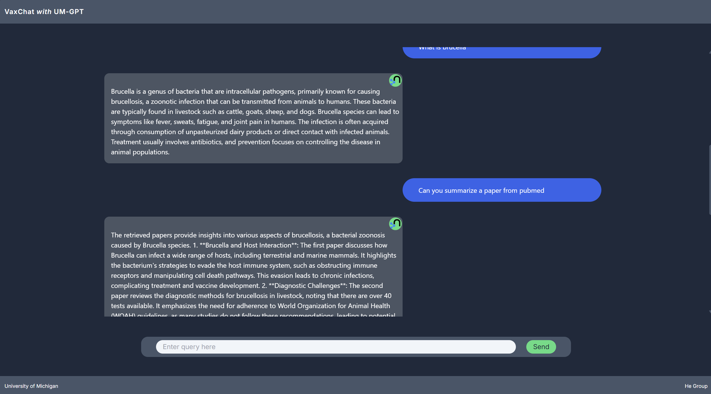

# PaperToData
An Agentic RAG System for Vaccines, complete with frontend and agentic backend. 

VaxChat utilizes a variety of tools to answer user queries using retrieved data.
## Table of Contents 
- [Installation](#installation) 
- [Usage](#usage) 
- [Example](#example) 

## Installation
1. Clone the repository: 
```bash 
> git clone https://github.com/crazab0i/VaxChat.git
```

2. Install dependencies:
```bash
> pip install -r requirements.txt
```

3. Set up .env files within the project root:  

	- langchain.env 
	- llm.env
    - email.env
    - neo4j.env

	Make sure that the fields are encapsulated as strings:
	```cpp
	FIELD_NAME="value_here"
	```

	### langchain.env
	```cpp
	LANGCHAIN_ENDPOINT={YOUR_ENDPOINT}
	LANGCHAIN_TRACING="true" 			//default is true
	LANGCHAIN_API_KEY={YOUR_API_KEY}
	```
	### llm.env
	```cpp
	DEPLOYMENT={MODEL_NAME} 			// gpt-4o-mini is good
	API_VERSION={VERSION} 				// 2024-06-01 is good
	API_KEY={YOUR_API_KEY}
	ENDPOINT={YOUR_ENDPOINT}
	ORGANIZATION={YOUR_ORGANIZATION} 
	```
  	### email.env
	```cpp
	EMAIL={ENTREZ_EMAIL}    //use an email for Entrez API, required for PubMed API searching
	```
	### neo4j.env
	```cpp
	NEO4j_URI={URI}
	NEO4J_USER={USER}
	NEO4J_PASSWORD={PASSWORD}
	```

## Usage
To run the program, you need to start the frontend and backend: 
### Frontend 
```cpp
npm run dev               // within the frontend folder
```
### Backend 
```cpp
> python3 ./vaxchat.py   // within the backend folder
```
If python3 does not work:
```cpp
> python ./vaxchat.py
```


## Example
### Frontend

### Backend Pipeline


